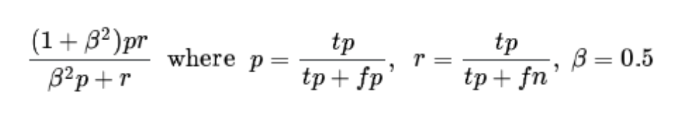

## KAGGLE INK DETECTION COMPETITION

- 3d X-ray image data
- result : 64 / 1249 Bronze Medal
- [Competition link](https://www.kaggle.com/competitions/vesuvius-challenge-ink-detection/overview)
- [PPT resource](https://www.canva.com/design/DAFszx6Qutw/wxgUhIHMv63AMy8gaoiV7w/view?utm_content=DAFszx6Qutw&utm_campaign=share_your_design&utm_medium=link&utm_source=shareyourdesignpanel)

 

----

 

# 대회 설명

- [목적] 예전 고대에 화산폭발로 인해 유산들이 불타거나 재가 되어버린 상황에서 타버린 파피루스(종이)안의 고대 언어로 된 글씨 잉크자국을 탐지 (Segmentation)

 

### DATASET

- dataset info
  - train: 4um 3d X-ray scan image, 3 fragment
  - 각 조각은 7000 - 14000 pixel size를 가진 tif files
  - 각 조각은 65개의 layer로 구성되어 있다. 파피루스가 여러겹으로 되어 있어서 과학기술을 통해 그 layer들을 한 장씩 scan하여 데이터화를 한 것

  - label : train image와 같은 사이즈의 ink masked image

 

-----

 

## Training Plan

## 문제인식 및 해결방법

[문제] 1. 각 65layer로 이루어진 3개의 train image를 어떻게 해야 잘 학습시킬 수 있을까? 불에 탈 때 밖의 면부터 타들어가서 안쪽일수록 ink부분이 잘 보존되어 있지 않을까?

EDA 
- 각 이미지에서 layer별로 ink부분과 ink부분이 아닌 곳의 분포를 살펴본다.
- 각 fragment에서 layer별로 ink와 ink가 아닌부분의 분포가 달랐다. 특히 18 ~ 40 layer에서 분포의 차이를 발견함 (학습에 이 부분을 이용하면 모델이 더 잘 구분하지 않을까?) 
- 3 조각 다 65 layer중 가운데쪽(28~34) 분포가 다름 (가운데 부분을 집중적으로 학습하면 좋지 않을까?)
- 1,3 조각의 분포는 거의 비슷했지만 2번의 분포는 다름 ( 1,3과 2를 섞어서 학습시키는게 더 좋을까?)

2. 사이즈가 큰 이미지를 어떻게 학습하면 좋을까?
- (8181, 6330), (14830, 9506), (7606, 5249)의 크기를 가진 image를 어떻게 학습시킬까?
  - image를 쪼개서 모델의 input size로 tile화를 시키자.
    - **224x224, 이미지가 부족하다고 생각하면 window sliding 기법을 통해 augmentation을 좀 더 hard하게 한 다음 학습을 진행하자**
    - **잉크가 없는 부위는 filtering을 통해 학습 데이터에서 제외시키자.**

- 1,3은 분포가 비슷하고 2는 분포가 다를 때 어떻게 학습시키는 것이 일반화에 도움이 될까?
  - **조각을 여러 부분으로 구분한 다음 kfold를 진행하면서 가장 성능이 좋은 부위를 찾자.**
  - 예컨대 1,2,3을 1a, 1b, 2a, 2b, 3a, 3b 이런 식으로 나눈 다음 1a를 validation set으로 나머지는 train set으로 학습을 진행

 

-----

 

## 평가지표 - Sorensen-Dice coefficient

- 예측한 부위와 실제 부위가 얼마나 겹치는지 판단하는 지표
- 겹치는 부위가 많을수록 점수가 상승
- **중요한 점은 precision이 높을수록 더 높은 점수를 보장한다는 점**
- 예컨대 precision이 0.6 이고 recall 0.7이면 0.6176, 반대로 precision이 0.7이고 recall이 0.6이면 0.6774
- **학습 후 제출할 때 precision이 높은 threshold를 적용하여 제출하는 것이 어떨까?**

 

---

 

## MODEL

- Segmentation task에서 대중적 모델인 unet구조를 사용
- 가장 가벼운 모델부터 시작하여 실험을 통해 점차 데이터부분을 수정한 후 모델링 수정을 하는 것이 시간과 노력을 절약할 수 있음
  - 빠른 학습, 빠른 실험, 오버피팅 위험 회피 
- Resnet34d  Unet 구조를 사용
- input shape : [BATCH, LAYERS, WIDTH, HEIGHT] # MULTI LAYER INPUT
- output shape : [BATCH, 1, WIDTH, HEIGHT] # INK MASK
  
 

---

 

## Loss & Metric

- segmentation task에서 사용하는 loss로는 대표적으로 bce, dice loss가 있고 bce, softbce, dice, combine(bce, dice)를 모두 실험한 결과 bce 단일이 더 성능이 좋다는 것으로 판단
- 또한 segmentation task에서 threshold는 모델을 통해 나온 mask image pixel value가 0 ~ 1사이의 값을 지니는데 이 때 threshold 이상인 값들을 1, 미만인 값을 0으로 수정하여 mask image를 처리하여 metric을 계산할 수 있음

 

---

 

## Result

- 가장 높은 CV를 지닌 모델과 가장 높은 LB value를 지닌 모델을 제출했을 때 가장 높은 lb value를 지닌 제출이 높은 점수를 받음, 이 때 precision을 0.5에서 0.65까지 올려보면서 실험했을 떄 0.5보다 0.65가 높은 점수를 받음
- **public score: 0.657029, 128 place / private score: 0.596765, 64 place**

 

---

## Review

**1. 개인적으로 대회를 통해 배운 점**

- 이미지를 어떻게 전처리 하는지 많은 사람들의 코드와 디스커션을 통해 알게 됨
- 이미지 데이터를 분석할 때 각 이미지의 분포를 활용하여 모델이 잘 학습할 수 있게 하는 방법을 알게 됨
- 매트릭 정보를 활용하여 제출에 활용했을 때 더 좋은 성능을 가질 수 있다는 점을 알게 됨

 

**2. 상위 랭크들의 코드와 디스커션을 통해 배운 점**

- 활용 가능한 layers들을 뽑고 학습에 이용한 몇개의 layer를 랜덤하게 뽑아서 더 많은 정보를 활용함
- 비슷하게 다양한 IMAGE SIZE, STRIDE SIZE, CROP SIZE를 활용하여 더 다양한 이미지 형태를 모델이 학습하게 함
  - 224 * 224
  - 256 * 256
  - 384 * 384
  - 512 * 512
  - 1024 * 1024
  - ...
- 다양한 모델들을 ensemble하여 최종 점수를 끌어 올린 점
  - segformer
  - resnet50
  - convnext_tiny
  - swinv2 
  - ...
- 다양한 augmentation을 활용
  - cutmix
  - mixup
  - manifold mixup
  - mosaic
  - ...
- EMA와 같은 기법들을 활용하여 성능을 상승시킴 
  - tta
  - ensemble
  - amp
  - ...

 

- 항상 더 많은 실험들을 도전하면 좋겠다고 생각함, 특히 한정된 리소스에서(주당 gpu 30시간, 또는 gpu size 16gb) 어떻게 하면 더 효율적인 방법일까를 고민하게 된다. 어떤 근거를 가지고 어떤 판단을 하고 그 결과가 성과에 영향을 준다는 점이 매우 귀중한 경험이라고 생각한다. 다음에는 더 다양한 실험을 해보자.
